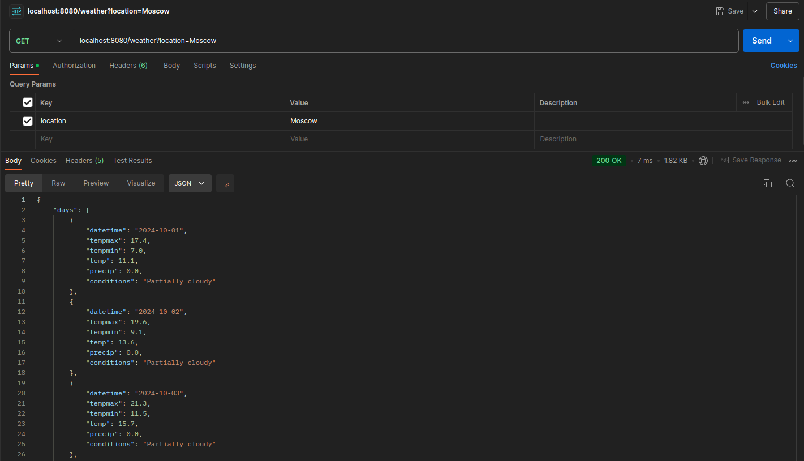
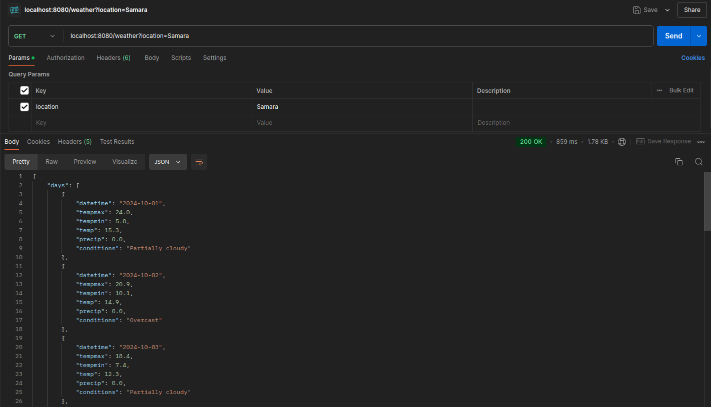

# Приложение для прогноза погоды

Приложение для прогноза погоды демонстрирует, как Spring Boot может интегрироваться с внешним API для получения и
отображения информации о погоде. Оно служит практическим примером создания RESTful веб-сервиса и работы с сторонним API
для извлечения данных.

### Содержание

- [Технологический стек](#технологический-стек)
- [Как запустить приложение](#как-запустить-приложение)
- [Вывод с использованием Postman](#вывод-с-использованием-postman)

### Технологический стек

- Java 17
- Spring Boot
- Spring Web
- Redis
- Maven

### Как запустить приложение

Чтобы протестировать или использовать приложение локально, выполните следующие шаги:

1. Клонируйте репозиторий: `git clone https://github.com/Breez97/Weather-App`.
2. Перейдите в директорию проекта: `cd /Weather-App`.
3. Измените файл `application.properties`, вставив свой API-ключ с `Weather Api Website`, и при необходимости измените конфигурацию `Redis`.
4. Постройте проект с помощью Maven: `mvn clean install`.
5. Запустите приложение: `mvn spring-boot:run`.
6. Протестируйте приложение по адресу `localhost:8080/weather?location={ВАШ-ГОРОД}`.

### Вывод с использованием Postman

Получение информации о погоде в Москве:

Получение информации о погоде в Самаре (859 мс):

Получение кэшированной информации о погоде в Самаре (15 мс):

