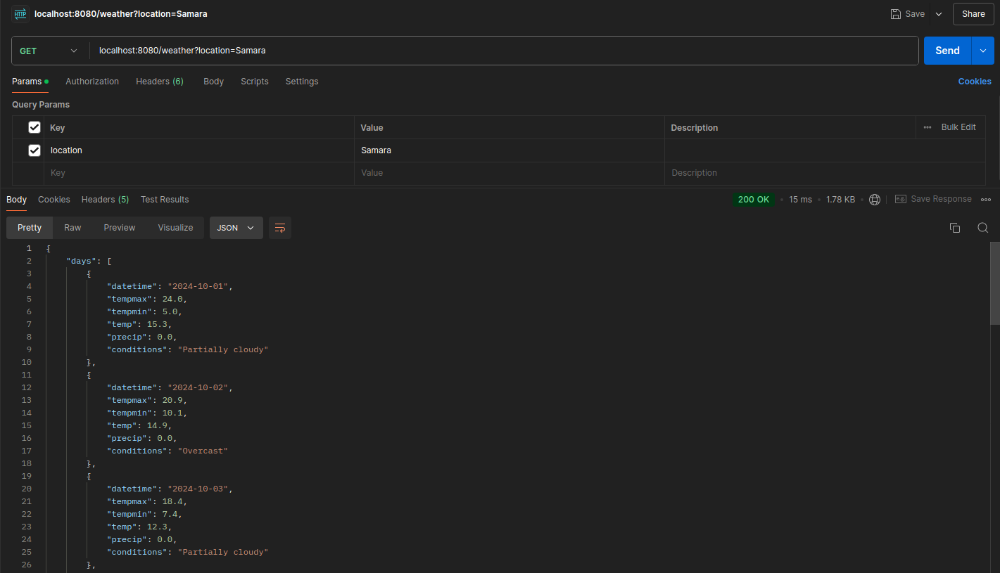

# Weather App

The Weather App is an application that demonstrates how Spring Boot can integrate with an external API to fetch and
display weather information. It serves as a practical example of building a RESTful web service and working with a
third-party API for data retrieval.

### Content

- [Tech Stack](#tech-stack)
- [How To Run The Application](#how-to-run-the-application)
- [Output using Postman](#output-using-postman)

### Tech Stack

- Java 17
- Spring Boot
- Spring Web
- Redis
- Maven

### How To Run The Application

To test or use the application locally, follow these steps:

1. Clone the repository: `git clone https://github.com/Breez97/Weather-App`.
2. Move to the project directory: `cd /Weather-App`.
3. Change `application.properties` file by inserting your API Key
   from [Weather Api Website](https://www.visualcrossing.com/weather-api) and change `Redis` configuration if necessary.
4. Build the project using maven: `mvn clean install`.
5. Run the application: `mvn spring-boot:run`.
6. Test the application by `localhost:8080/weather?location={YOUR-CITY}`

### Output using Postman

Getting info about weather in Moscow:

Getting info about weather in Samara (859 ms):

Getting cached info about weather in Samara (15 ms):

